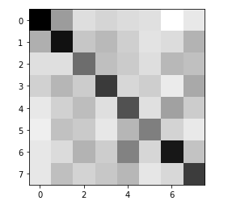

# My python sound research programs

* Sample generator: `generate_simple.ipynb`

* Pink Panther song theme generator: `generate_pink_panther.ipynb`

* Authentication by voice: `auth.ipynb`

# Голосовая идентификация

Самое интересное в этой части. Цель: взять два голоса и научиться их сравнивать, отличая друг от друга на основе спектрального анализа

Вот что делается для этого:

Вот матрица 8x8 различий 2 голосов, по 4 записи каждый (чем темнее, тем более похоже):

Вот матрица усредненных значений по голосам (чем светлее, тем более похоже):
